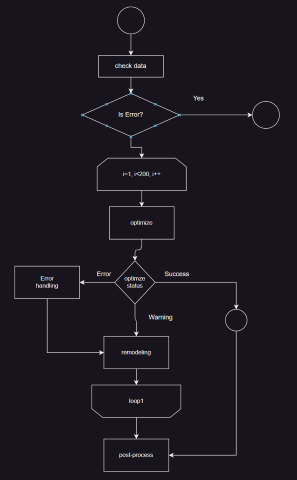
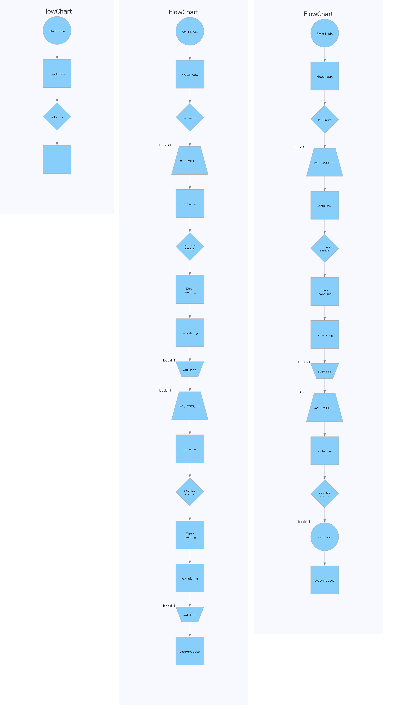

# Flow Chart Explorer
It’s difficult to identify all the execution paths of a complex program from a flowchart, isn’t it? Flow Chart Explorer analyzes and visualizes all execution paths in a flowchart.

## Features

You can input a flowchart file (`.drawio`) drawn with the graph tool (draw.io), and FlowChartExplorer can output all the execution paths as `.png` files.

### Input file(`drawio`)

This flow chart has eight execution paths.




### Output files

These are three excerpts from the total of eight execution paths that were automatically generated by this tool from the above .drawio file.



## Usage

```python
from pathlib import Path

from flowchart_explorer.chartpath import FlowChartPath
from flowchart_explorer.explorer import Explorer
from flowchart_explorer.graph.drawio import Drawio

def main():
    # input drawio file path
    drawio = Drawio(Path("./charts/sample_chart.drawio"))
    graph = drawio.get_graph()
    explorer = Explorer()
    key, flow_path = explorer.run(graph)
    dir_path = Path("tests/chart_path/simple_double_loop_chart")
    flowchart = FlowChartPath(dir_path=dir_path)
    flowchart.draw(flow_path=flow_path, graph=graph)
```


## Guidelines for Flowchart Creation


