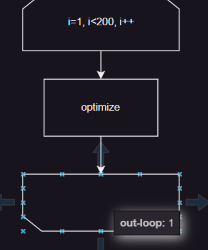
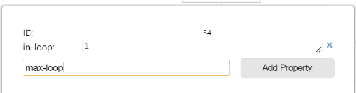

# Flow Chart Explorer
It’s difficult to identify all the execution paths of a complex program from a flowchart, isn’t it? Flow Chart Explorer analyzes and visualizes all execution paths in a flowchart.

## Features

You can input a flowchart file (`.drawio`) drawn with the graph tool (draw.io), and FlowChartExplorer can output all the execution paths as `.png` files.

### Input file(`drawio`)

This flow chart has eight execution paths.


### Output files

These are three excerpts from the total of eight execution paths that were automatically generated by this tool from the above .drawio file.


## Usage

`sample_exe.py` is a implementation example.

```python
from pathlib import Path

from flowchart_explorer.chartpath import FlowChartPath
from flowchart_explorer.explorer import Explorer
from flowchart_explorer.graph.drawio import Drawio

def main():
    # input drawio file path
    drawio = Drawio(Path("./charts/sample_chart.drawio"))
    graph = drawio.get_graph()
    explorer = Explorer()
    key, flow_path = explorer.run(graph)
    dir_path = Path("tests/chart_path/simple_double_loop_chart")
    flowchart = FlowChartPath(dir_path=dir_path)
    flowchart.draw(flow_path=flow_path, graph=graph)
```


## Guidelines for Flowchart Creation

### Prerequisites

- It may be obvious, but the flowchart needs to be a Directed Acyclic Graph (DAG). It must not contain any cyclic structures.
- There should be only one flowchart, starting from a single Start Node, in each `.drawio` file.
- Currently, this tool only supports flowcharts created with drawio. (In the future, we have internally considered supporting other tools if there is a user demand.)

### Guidelines for drawio

#### Start Node


- The "Start Node" should be created as an <u>Ellipse or Circle</u>, and should only be the source of Edges.
- Again, there should be only one Start Node in the flowchart.

#### Loop

Please enclose loop processes like `while` and `for` statements with a set of ***"In Loop"*** and **"*Out Loop*"** . Also, these nodes need to have properties set for handling multiple loops. Please refer to the example in `charts/example_chart.drawio`.

##### In Loop(Loop Limit)

Represents the starting point of the loop process.


###### Properties

You need to set `in-loop` (required) and `max-loop` (optional).

- `in-loop` (required): This is the id name to identify the loop. Please set it as an integer value. **Please set the same value for both the In Loop and Out Loop nodes.**
- `max-loop` (optional): This is the number of loops that the "Flow Chart Explorer" will iterate for path exploration. The default is 2 times, so set it only if you want to change it.

##### Out Loop(**Reversed Loop Limit**)

Represents the end point of the loop process.



###### Properties

- `out-loop` (required): This is the id name to identify the loop. Please set it as an integer value. **You must set the same value as the “in-loop” of the corresponding “In Loop”.**

##### Exit Loop

If you need to `break` from the loop process due to a status or other condition and exit midway, please add an **Exit Loop** node to the exit route. <u>This is a rule that strongly depends on the “Flow Chart Explorer” specification.</u>


- The “Exit Loop” should be created as an Ellipse or Circle. Be sure to set the `exit-loop` property to the id value of the loop you want to exit.

###### Properties

- `exit-loop` (required): This is the id name to identify the loop you want to exit. Please set it as an integer value.

### **Supplementary Notes**

- There is no problem with how many edges come out from one node for conditional branching. Also, the type of node for conditional branching in drawio does not necessarily have to be a Diamond.


### Setting Node Properties Procedure

Right-click on the node → Edit Data


2. Input those properties  →  Add Property  →  Input value



3. Click Apply


